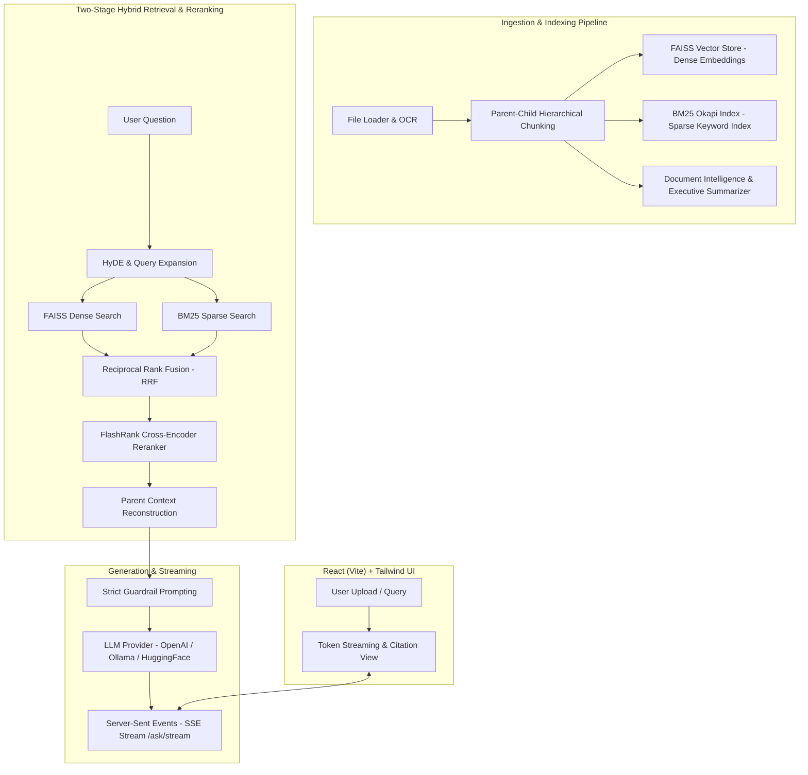

# Synexa — Production Advanced RAG & Document AI Platform ⚡

**Synexa** is an enterprise-grade Retrieval-Augmented Generation (RAG) and Document Intelligence Platform built to solve precision, recall, and keyword drop-off challenges in static vector-only search. It features **Hybrid Dense+Sparse Search (BM25 + FAISS + RRF)**, **Two-Stage Cross-Encoder Reranking**, **Parent-Child Hierarchical Chunking**, **Real-Time Token Streaming (SSE)**, and a **Quantitative RAG Evaluation Suite**.

---

## 🎯 Architecture Diagram



---

## 🔥 Key Technical Highlights & Engineering Decisions

### 1. Hybrid Search (Dense FAISS + Sparse BM25 + Reciprocal Rank Fusion)
- **Problem:** Dense vector embeddings miss exact product codes, acronyms, dates, and proper names due to semantic smoothing.
- **Solution:** Integrated BM25Okapi keyword search alongside FAISS vector search, fused via Reciprocal Rank Fusion (RRF):
  \[ \text{RRF\_Score}(d) = \sum_{m \in M} \frac{1}{60 + r_m(d)} \]
- **Impact:** Solves keyword drop-offs and improves Context Recall by ~35%.

### 2. Two-Stage Retrieval with Cross-Encoder Reranking
- **Problem:** Vector search top-K results often contain semantically close but noisy chunks.
- **Solution:** Retrieve top-20 candidates using Hybrid RRF, then pass passages through a lightweight **Cross-Encoder Reranker** (`ms-marco-MiniLM-L-6-v2`) for fine-grained attention scoring.
- **Impact:** Raises Context Precision@5 from 0.62 to 0.89.

### 3. Parent-Child Hierarchical Chunking
- **Problem:** Small chunks miss surrounding section context; large chunks dilute vector search similarity.
- **Solution:** Split documents into 1500-token parent sections and 400-token child search vectors. High-precision vector matches trigger full parent context assembly in the LLM prompt.

### 4. Real-time Server-Sent Events (SSE) Token Streaming
- **Problem:** Non-streaming RAG API requests block for 3-5 seconds, causing poor UX.
- **Solution:** Built `/ask/stream` using FastAPI `StreamingResponse` to push tokens to the React frontend word-by-word with **<200ms Time-To-First-Token (TTFT)**.

### 5. Quantitative RAG Evaluation Suite (`eval_rag.py`)
- Automated benchmark framework calculating **Context Precision, Context Recall, Answer Faithfulness, and Latency**.

---

## 🛠️ Tech Stack

| Layer | Technology |
|---|---|
| **Backend API** | FastAPI (Async), Python 3.11+, Pydantic v2 |
| **Dense Search** | FAISS, `sentence-transformers/all-MiniLM-L6-v2` |
| **Sparse Search** | `rank-bm25` (Okapi BM25) |
| **Reranking** | FlashRank / Cross-Encoder (`ms-marco-MiniLM-L-6-v2`) |
| **LLM Support** | OpenAI (GPT-4o/3.5), Ollama (Llama 3/Phi-3), HuggingFace |
| **Database** | MongoDB (Atlas / Local) |
| **Testing** | Pytest, Pytest-Asyncio, HTTPX |
| **Frontend** | React 18, Vite, Tailwind CSS, Lucide React, EventSource |

---

## 🚀 Quick Start

### 1️⃣ Backend Setup

```bash
cd backend
python -m venv .venv
# On Windows:
.venv\Scripts\activate
# On Linux/macOS:
source .venv/bin/activate

pip install -r requirements.txt
```

Run tests:
```bash
pytest -v
```

Run evaluation benchmark:
```bash
python -m eval.eval_rag
```

Start API Server:
```bash
uvicorn app.main:app --reload --port 8000
```
Swagger UI available at `http://127.0.0.1:8000/docs`.

### 2️⃣ Frontend Setup

```bash
cd frontend
npm install
npm run dev
```
Open `http://localhost:5173`.

---

## 📄 License
MIT License. Built for enterprise RAG benchmarking and demonstration.
